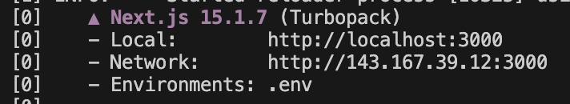

# How to run mobVis

1. Clone this repository into your system.
2. Open terminal.
3. `cd` into your local repository folder, then `cd mobvis-app`. This is where the actual Next.js project lies.
4. Run `npm run dev` in your terminal and a local server running the project should show in the terminal. (see image below)
    
   
    
5. Enter the URL into your preferred browser and start using mobVis.
6. There are test CSV files with associated metadata that you can test the interface with. A larger recording file can be found [here](https://drive.google.com/file/d/1jAkQli0QtsLrlVSY6r_Uh5ow4U-jhsBG/view?usp=sharing), and a smaller recording file [here](https://drive.google.com/file/d/1jGn1Zm9KASzCb_steYBibl-GjlGZWgYb/view?usp=sharing). The metadata can be found in the `resources` folder.
